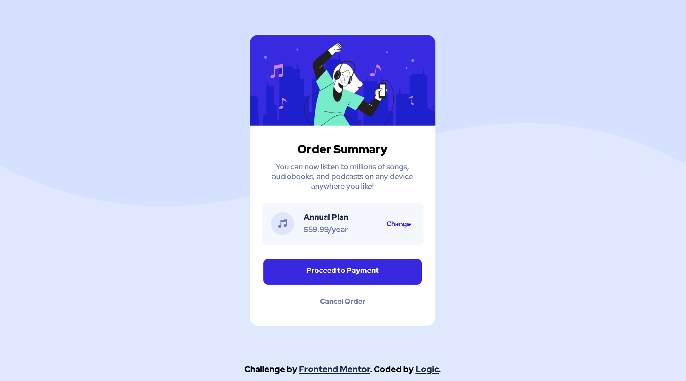

# Frontend Mentor - NFT preview card component solution

This is a solution to the [NFT preview card component challenge on Frontend Mentor](https://www.frontendmentor.io/challenges/nft-preview-card-component-SbdUL_w0U). Frontend Mentor challenges help you improve your coding skills by building realistic projects. 

### The challenge

Users should be able to:

- View the optimal layout depending on their device's screen size
- See hover states for interactive elements

^ Hahah I only did the second one

### Screenshot



### Built with

- HTML5
- SCSS (superset of css)


### What I learned

Below are some code snippets that I'm proud of, of which the biggest would be my first time use of flexbox for centering. I also finished this project in around 4 hours, new record for me! (Most of the time was spent researching questions)


Finally found out I should divide my page into sections. Literally.
```html
<section class="summary-title">
  Order Summary
</section>

<section class="summary-desc">
  You can now listen to millions of songs, audiobooks, and podcasts on any 
  device anywhere you like!
</section>

<section class="plan-info">
  
  <section class="time-price">
    <section class="plan-type">Annual Plan</section>
    <section class="plan-price">$59.99/year</section>
  </section>
  <section class="change"><a href="#" class="href">Change</a></section>
</section>

<section class="payment-button">
  Proceed to Payment
</section>

<section class="cancel-order-button">
  Cancel Order
</section>
```
```css
.container {
  display: flex;
  flex-direction: row;
  justify-content: center;
  align-items: center;
  margin: 0;
  background-color: var(--pale-blue);
  width: 1440px;
  height: 95vh;
  margin-left: auto;
  margin-right: auto;

  .card {
      position: relative;
      z-index: 2;
      background-color: white;
      width: 27%;
      height: 610px;
      border-radius: 18px;
  }
}
```
## Author

- Website - [In-Progress]()
- Frontend Mentor - [@Logic](https://www.frontendmentor.io/profile/LogicPenguins)
- Twitter - [@Xmexy](https://twitter.com/Xmexyyy)

## Acknowledgments

Thank you to the guys over on the Programmer's Hangout Discord server for helping me out a bunch with this little project. First time doing a frontend mentor challenge
and can't say I would have been able to do it without them :)

Programmer's Hangout Discord: [Programmer's Hangout](https://discord.gg/programming)
